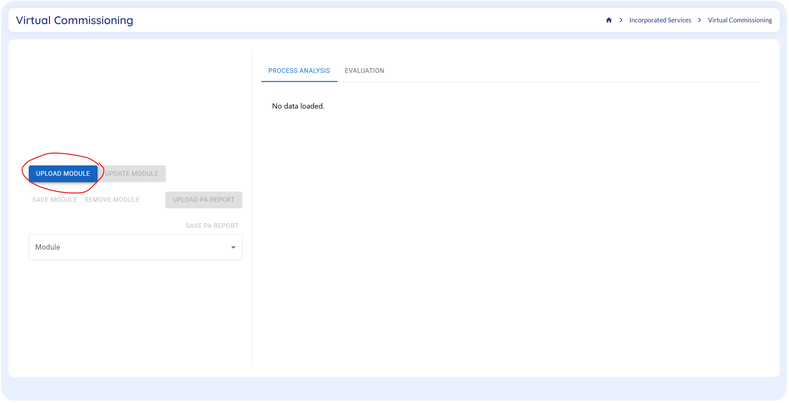
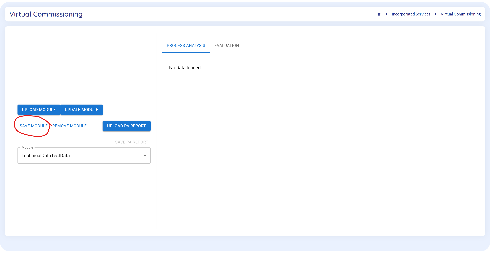
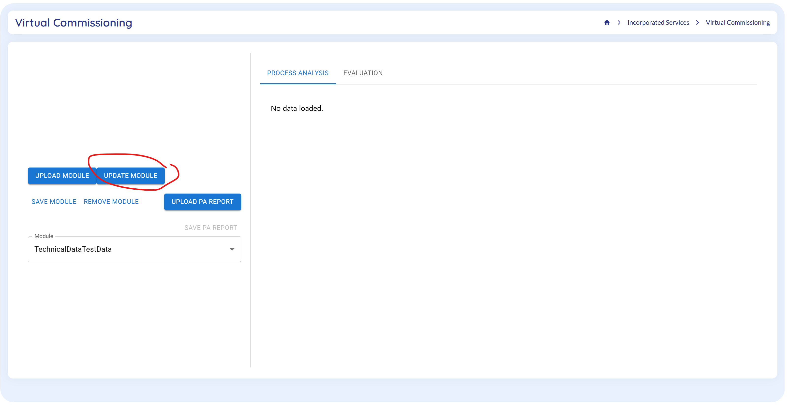
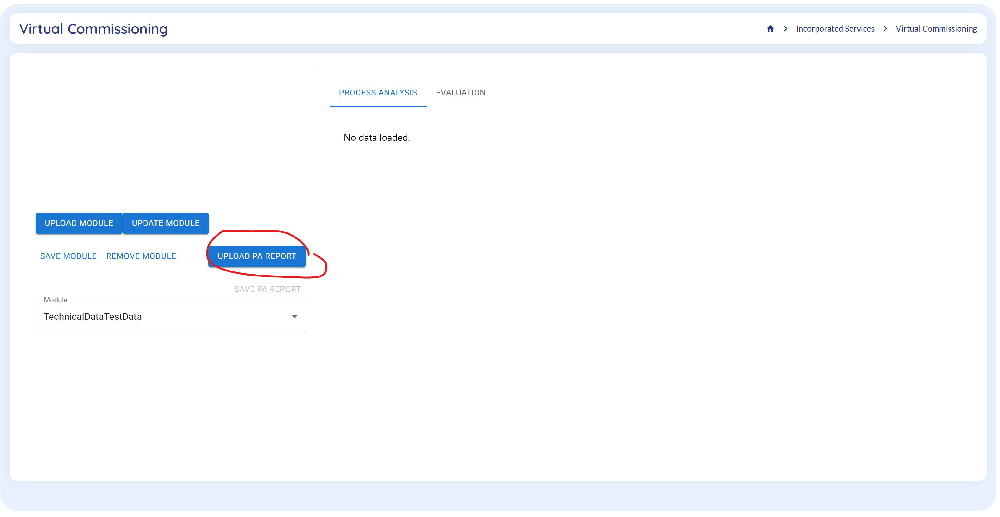
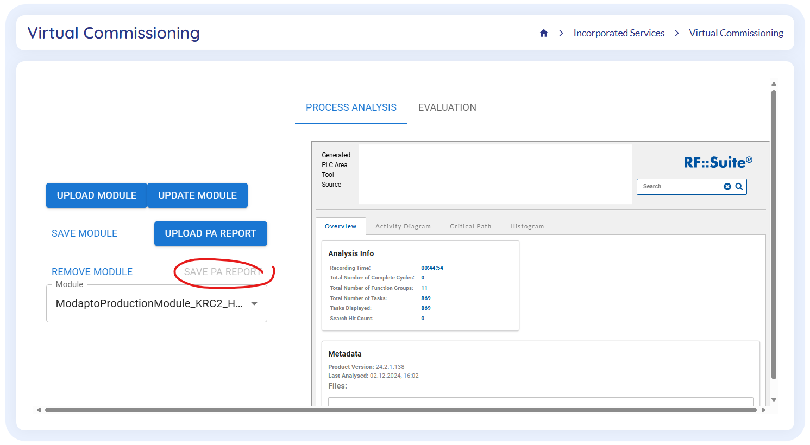
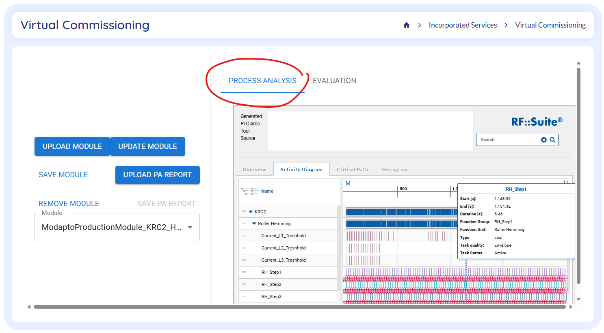
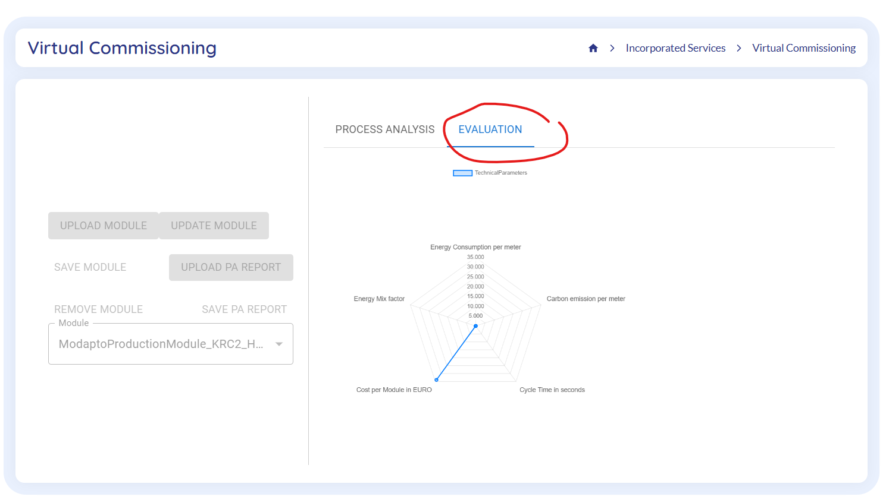
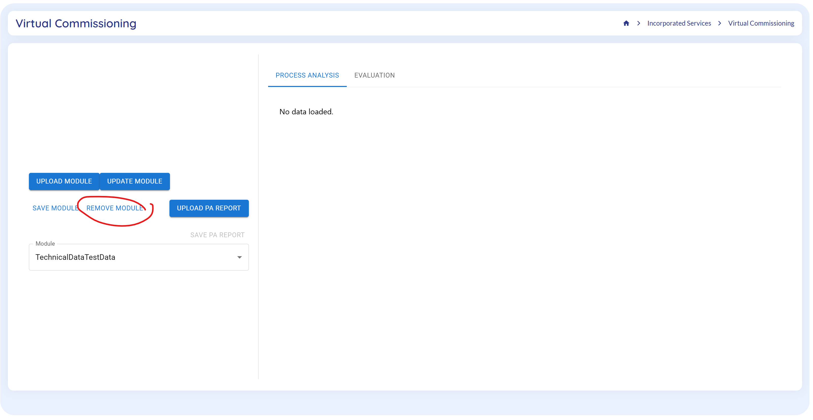

# Virtual Commissioning and virtual-commissioning-wrapper in MODAPTO

Virtual Commissioning consists of an industrial virtual commissioning software toolsuite (in this case RF::SUITE) and the MODAPTO integrated GUI (VC wrapper application) which provides access to MODAPTO system users which is included in this present repository.
The VC wrapper application may be used in combination with every VC toolsuite 
- supporting AAS and FMI standard for production module descriptions and simulations and
- providing AAS and HTML based results.

The Virtual Commissioning Wrapper application enables the user to perform the following functions.

- Upload MODAPTO Module to MODAPTO system from a virtual commissioning user storage

- Download MODAPTO Module to a user storage (incl. FMUs) to a virtual commissioning user storage

- Update MODAPTO Modules with included virtual commissioning results comprising sustainability metrics after Virtual Commissioning

- Upload Virtual Commissioning Process Analysis Report for a specific MODAPTO Module from a virtual commissioning user storage

- Download Virtual Commissioning Process Analysis Report for a specific MODAPTO Module to a virtual commissioning user storage

- Display MODAPTO Modules’ virtual commissioning results (process analysis report and sustainability metrics)

- Delete MODAPTO Module from MODAPTO system

